[TOC]

# 1. TeX Live的下载及安装(以TeX Live2019为例)

## 第1步：下载iso镜像文件

进入开源镜像站
http://mirror.ctan.org/systems/texlive/Images/
右键单击texlive2019.iso，复制链接地址，用迅雷就可以下载。

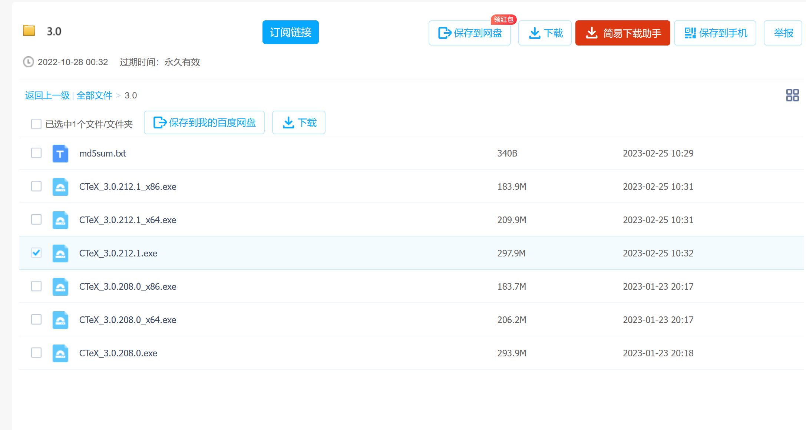

## 第2步：安装texlive2019

(1) 将下载好的texlive2019.iso文件进行解压，双击其中的批处理文件install-tl-advanced.bat

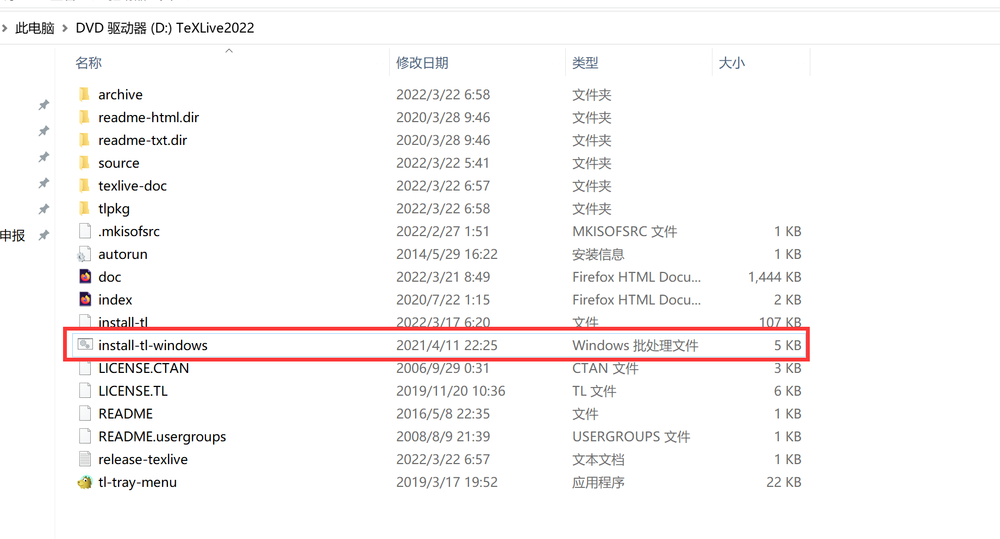

进入cmd模式，等待几秒。

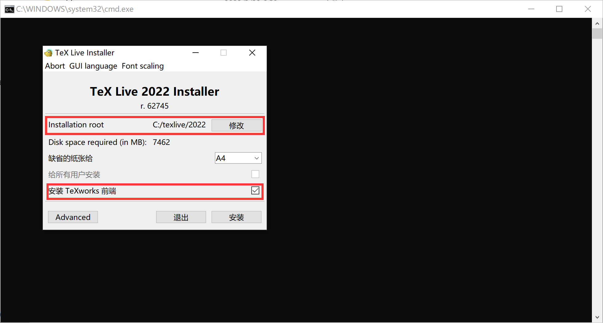

需要的硬盘空间比较大（5G），如果C盘剩余容量足够大，可以不修改主目录，直接安装在C盘；否则，修改主目录。Tex Live自带TexWorks编辑器，该编辑器过于简洁，不建议安装，“安装TexWorks前端”处不勾选。

(2) 点击“安装”，等待安装完毕（耗时较长）。最后点击 “关闭”即可。

# 2. SumtraPDF的安装

(1) 进入官网
https://www.sumatrapdfreader.org/download-free-pdf-viewer.html
右键单击第1个可执行文件SumatraPDF-3.1.2-install.exe，复制链接地址,用迅雷下载。

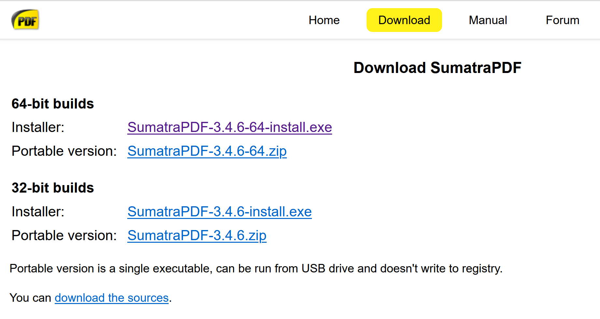

(2) 双击下载下来的SumatraPDF-3.1.2-install.exe,点击安装SumatraPDF即可。推荐默认路径
C:\Program Files (x86)\SumatraPDF
记住SumatraPDF的安装路径。

# 3. 编辑器的安装及配置（以WinEdt为例）

(1) 进入WinEdt官网，下载WinEdt 10.2（最新的10.3也可以）。
http://www.winedt.com/archive.html

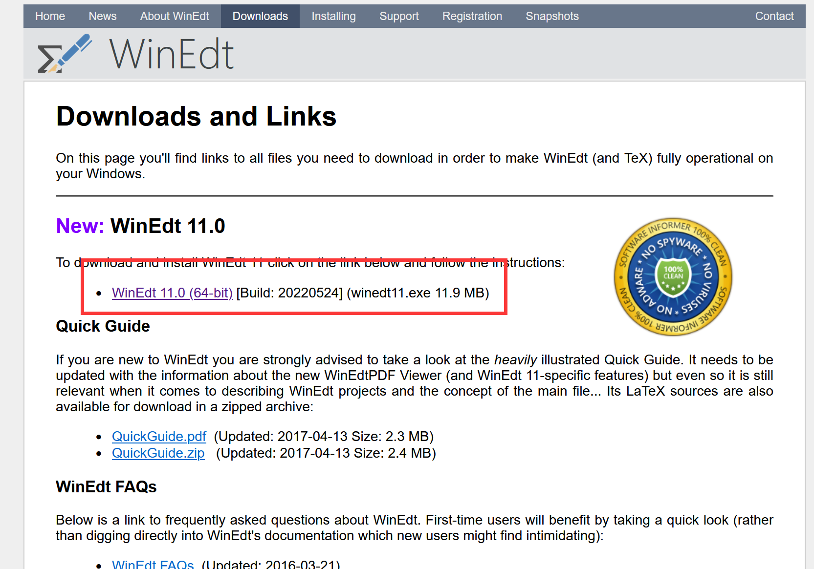

(2) 与大多数程序的安装过程类似，最后一步如下图，圈中部分选中：

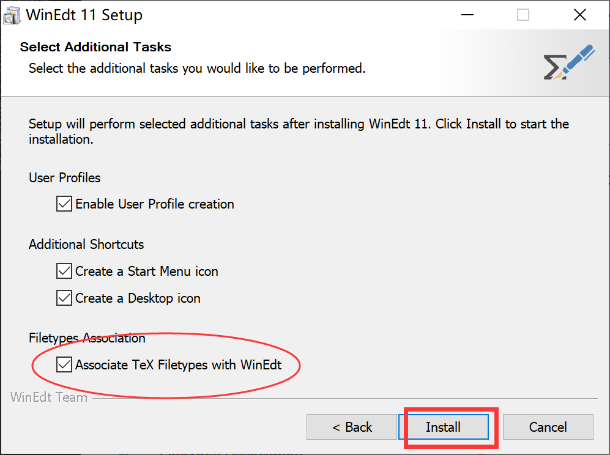

(3) 安装完毕后，打开WinEdt，点击菜单栏的Help->Register WinEdt，把以下[注册信息](https://www.52pojie.cn/thread-595351-1-1.html)
Name：Cracker TeCHiScy
Code：1130140925535334280.
输入进去，点击“OK”。

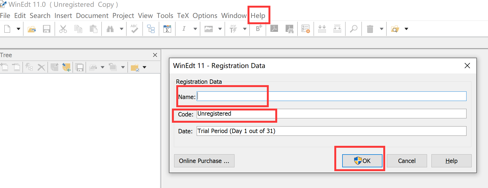

(4) 修改WinEdt的PDF阅读器。点击WinEdt菜单栏的Options->Excution Modes，弹出窗口，选择PDF Viewer, 点击下图第1个红色框放大镜，在弹出的窗口中找到你之前安装的SumtraPDF(默认安装在C:\Program Files (x86)\SumatraPDF )路径中的SumatraPDF.exe，点击“打开”。

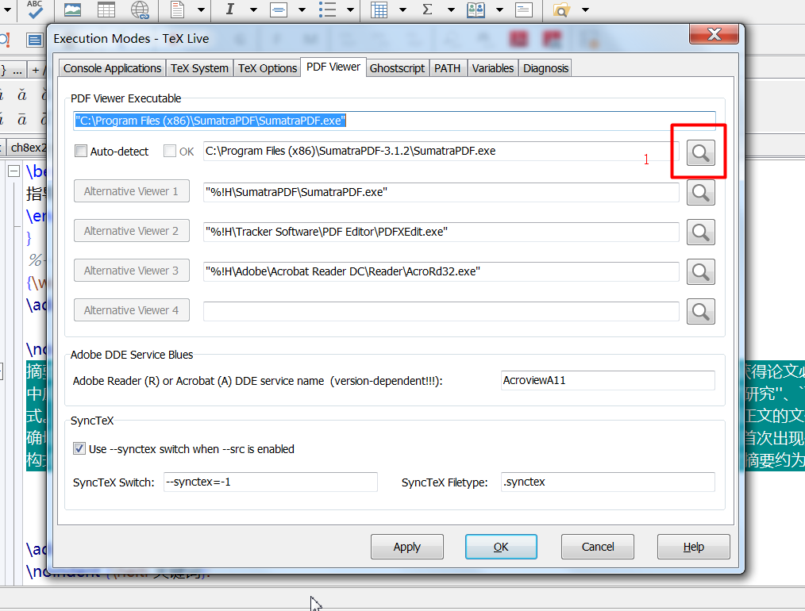

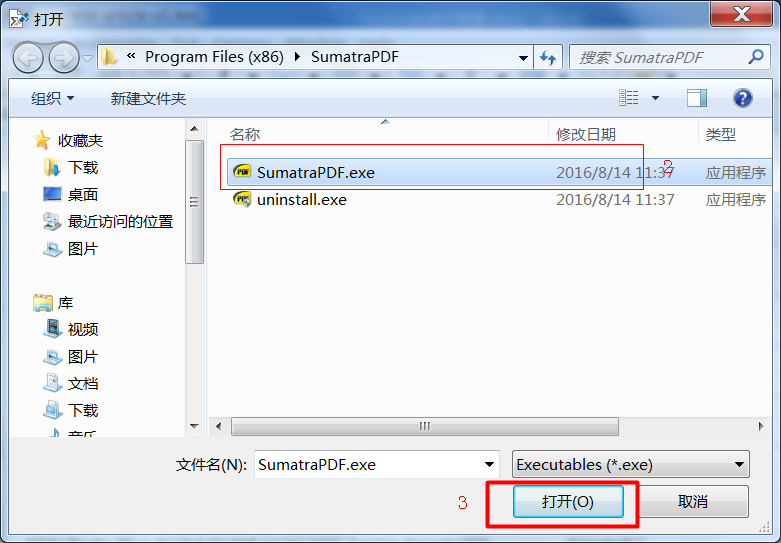

最后点击“Apply”，再点击“OK”即可。

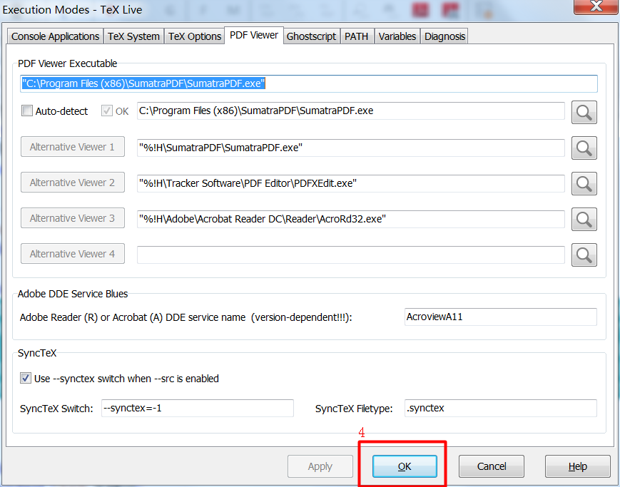

(5) 为了使用起来更方便，需要对界面布局进行配置。
- 选择菜单栏Options->Toolbar->Legacy Default；
- 菜单栏的View菜单中，尝试点击Tree（文档结构），Toolbar，TeX Symbols，Document Tabs，Line numbers等。
最终, 界面如下图

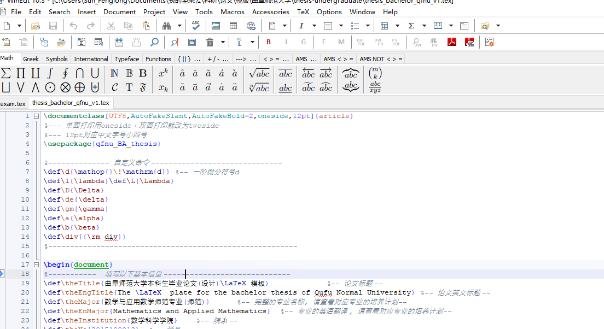

# 4. 编译.tex文件

打开一个.tex格式文件.

点击下图中的倒三角，
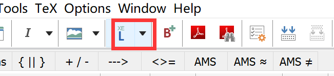
在下拉菜单中选择编译方式XeLaTeX(第一次选定好后,就固定了下来,以后不需要再重复设置)。
点击图中的L两次,就可以完成对tex文件的编译。

点击下图中的红框部分,就可以通过SumtraPDF查看生成的PDF文件。
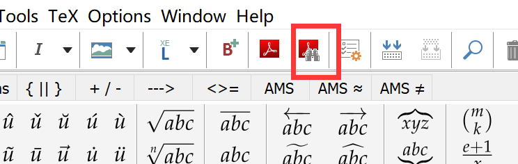
pdf文件中还显示tex文件中光标所在的位置对应的内容(正向搜索)。

鼠标左键双击上述PDF文件中需要修改内容的地方,就可以跳转回tex文件中对应的位置(反向搜索),可以进行相应的修改。
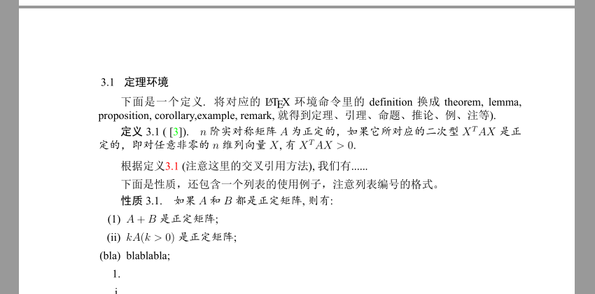

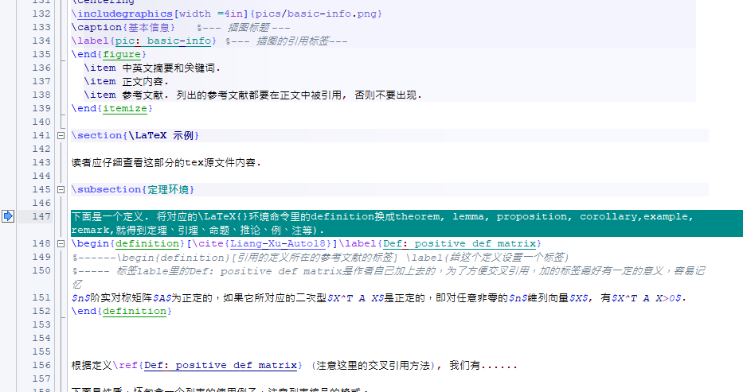

为了及时发现错误,在输入完成一小部分内容后(例如一句话),就要及时进行编译。